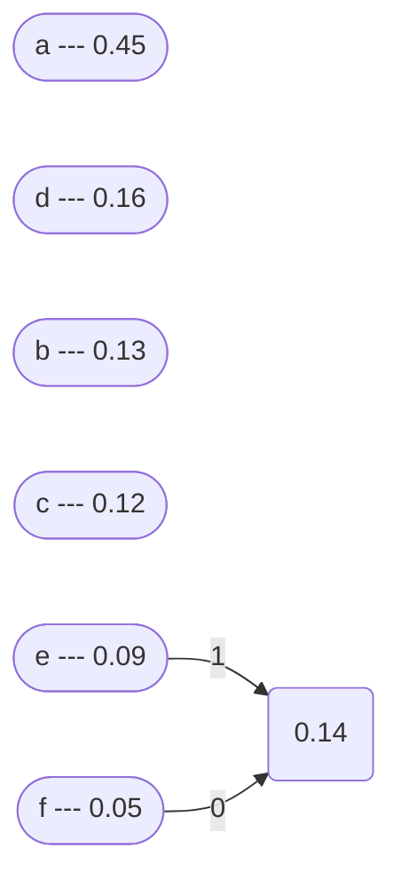
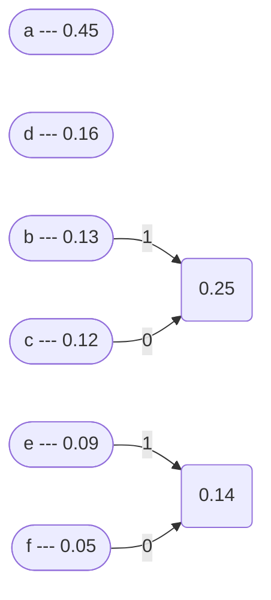
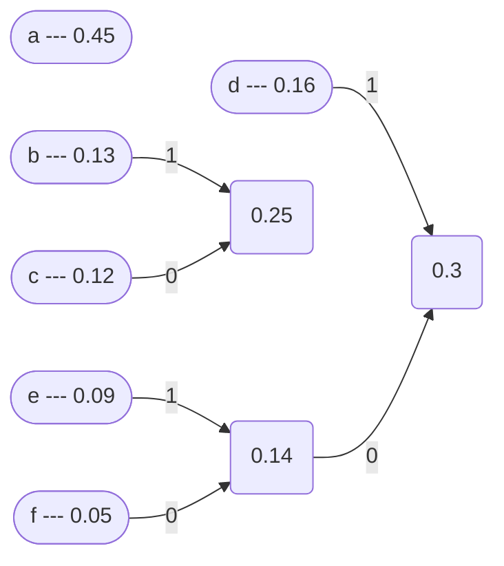
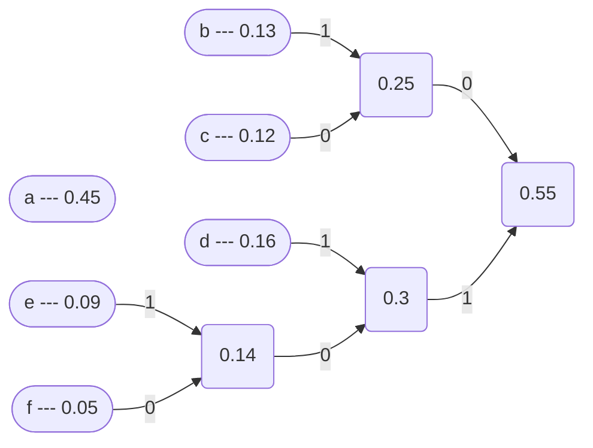
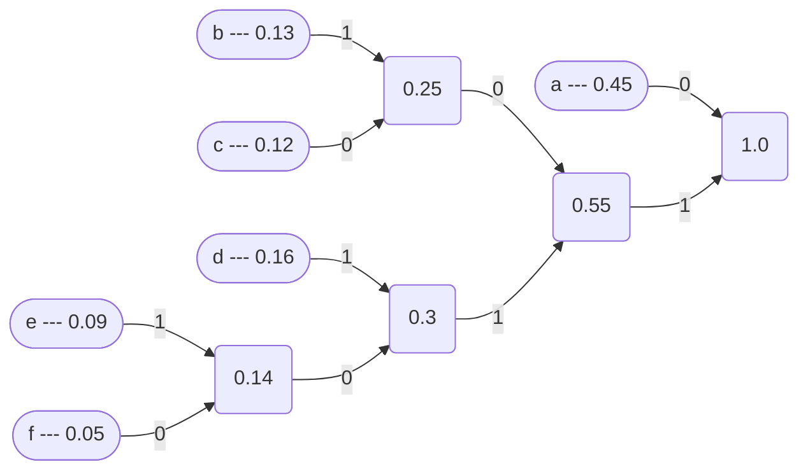

# Алгоритм Хаффмана

Алгоритм Хаффмана — жадный алгоритм оптимального префиксного кодирования алфавита с минимальной избыточностью.
В отличие от алгоритма [Шеннона-Фано](../shannon-fano/README.md), алгоритм Хаффмана остаётся всегда оптимальным 
и для вторичных алфавитов m2 с более чем двумя символами.

## Пример

Дан алфавит A={a,b,c,d,e,f} с вероятностями символов P={0.45, 0.13, 0.12, 0.16, 0.09, 0.05}.
Кодовый алфавит B={0,1}.

#### Шаг 1

Сортируем алфавит по убыванию частоты символов:

| Символ | Частота |
|--------|---------|
| a      | 0.45    |
| d      | 0.16    |
| b      | 0.13    |
| c      | 0.12    |
| e      | 0.09    |
| f      | 0.05    |

#### Шаг 2

Так как у нас двоичное кодирование, то берем два символа с наименьшей вероятностью, 
суммируем их, при этом элементу с наименьшей вероятностью сопоставим **0**, 
а элементу с наибольшей вероятностью **1**.

Повторяем процесс до тех пор, пока не останется один элемент.

#### Шаг 3

Составим полученные коды. 
Для этого нужно пройти от корня к каждому ребру и записать коды в соответствии с направлением движения.

| Символ | Код  |
|--------|------|
| a      | 0    |
| b      | 101  |
| c      | 100  |
| d      | 111  |
| e      | 1101 |
| f      | 1100 |

## Реализация на Python

...
