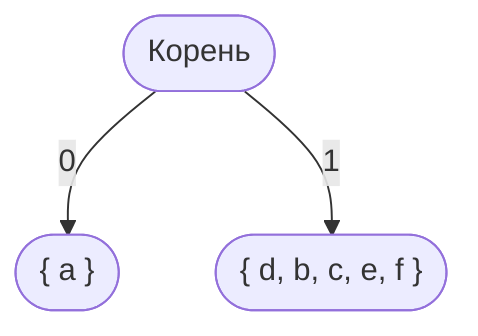
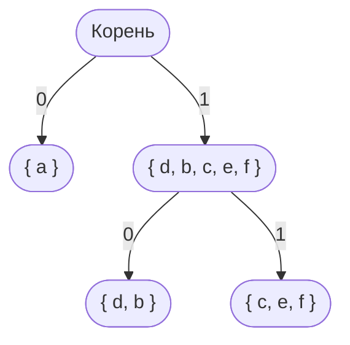
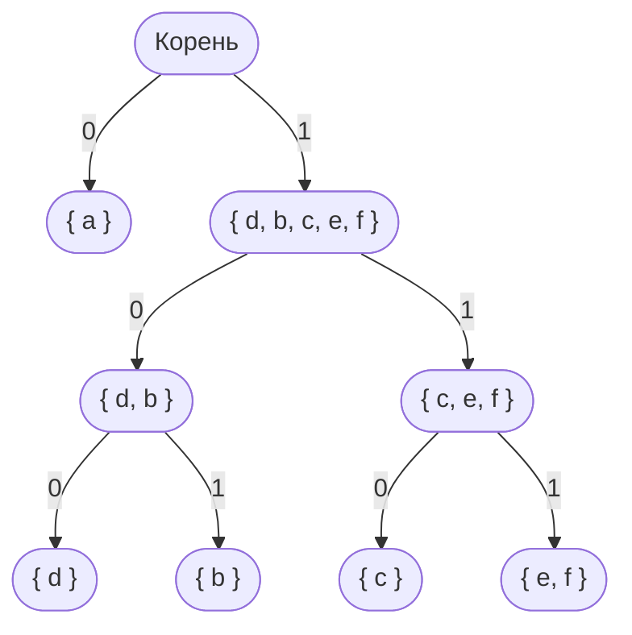
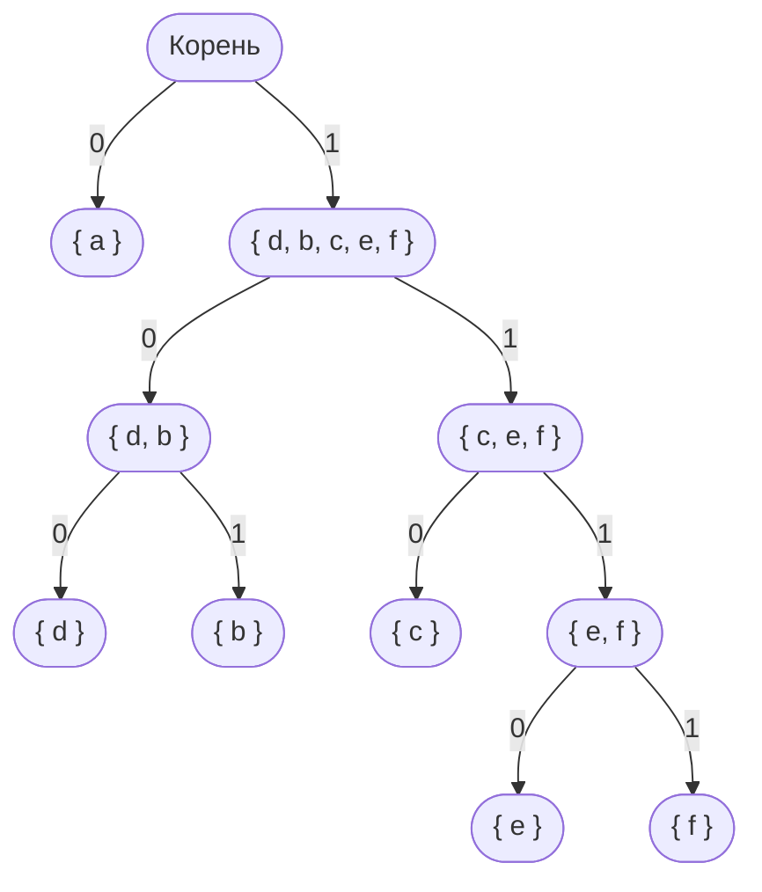

# Алгоритм Шеннона-Фано

Алгоритм Ше́ннона-Фанó — один из первых алгоритмов сжатия, который впервые сформулировали Клод Шеннон и Роберт Фано.
Алгоритм использует коды переменной длины: часто встречающийся символ кодируется кодом меньшей длины, 
редко встречающийся — кодом большей длины. 

Коды Шеннона-Фано — префиксные, то есть никакое кодовое слово не является префиксом любого другого. 
Это свойство позволяет однозначно декодировать любую последовательность кодовых слов.

# Пример

Дан алфавит A={a,b,c,d,e,f} с вероятностями символов P={0.45, 0.13, 0.12, 0.16, 0.09, 0.05}.
Кодовый алфавит B={0,1}.

#### Шаг 1

Сортируем алфавит по убыванию частоты символов:

| Символ | Частота |
|--------|---------|
| a      | 0.45    |
| d      | 0.16    |
| b      | 0.13    |
| c      | 0.12    |
| e      | 0.09    |
| f      | 0.05    |

#### Шаг 2

Делим алфавит на две группы(так как кодовый алфавит двоичный) таким образом, 
чтобы суммарная вероятность в каждой группе была примерно одинаковой.

Ветку слева помечаем **0**, ветку справа **1**.

Слева **0.45**, справа **0.55**.

Продолжаем делить до тех пор, пока не останется один элемент в каждой группе.

Слева **0.29**, справа **0.26**.

#### Шаг 3

Составим полученные коды, считывая их от корня дерева к символу.

| Символ | Код  |
|--------|------|
| a      | 0    |
| d      | 100  |
| b      | 101  |
| c      | 110  |
| e      | 1110 |
| f      | 1111 |

Считывание кода от корня дерева к символу обеспечивает его префиксность.

Принцип префиксности - никакое кодовое слово не должно являться началом другого кодового слова.

## Реализация на Python

...
